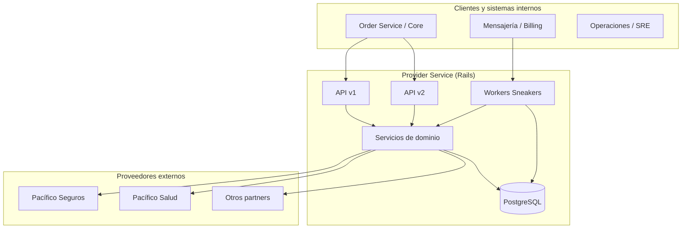

# Arquitectura y flujos

## Vista por capas

## Dos modelos de integración: v1 y v2

| Aspecto | v1 | v2 (Provider 2.0) |
|---------|----|-------------------|
| Enfoque | Transacciones con `type` + `process`; mucha lógica en servicios específicos por producto/proceso | Configuración en BD: `Rule`, `RuleAssignment`, merge con `custom_settings` |
| Resolución HTTP | `Providers::RequestBroker` con `namespace: 'v1'` (por defecto) | Mismo broker con `namespace: 'v2'` y clientes `Providers::V2::*` |
| Configuración | Parcialmente en código (`PermittedProcedures`) | Reglas con `api_settings`, `json_schema_payload`, parámetros request/response |

No son excluyentes: el mismo despliegue expone **ambas** APIs; el flujo que use Order/Core depende del producto y la madurez de la integración.

## Flujo conceptual v2 (cotización / emisión)

1. Existe **Product** con **Plans** y datos de integración.
2. Existe **DistributorChannel** (canal de venta) y la relación **RuleAssignment** entre plan (o producto), **Rule** y canal.
3. Una petición v2 incluye `product_code`, `plan_code`, `process`, `api_type` (p. ej. `quote` / `issue`) y opcionalmente canal.
4. `V2::Rules::ConfigurationService` resuelve la regla, valida y construye el payload de configuración (método, headers, endpoint, parámetros).
5. `Providers::RequestBroker.new(process:, namespace: 'v2').client(payload)` instancia el cliente (p. ej. Pacífico Seguros V2) que arma la petición HTTP y normaliza la respuesta.

Diagrama detallado: [`diagramas/flujo-emision-v2.puml`](./diagramas/flujo-emision-v2.puml).

## Flujo conceptual v1 (transacción + transición)

1. **POST** transacción: se crea `Transaction` con `type`, `process`, `request_payload`, estado inicial.
2. Según el tipo, `Brokers::ProcessManager` u otros servicios invocan la clase permitida en `Brokers::PermittedProcedures::TRANSACTIONS`.
3. **POST** transición de estado: validaciones de esquema (`TransitionPayloadValidator` cuando aplica) y ejecución de acciones asociadas al nuevo estado y proceso (`TRANSITIONS`).

Diagrama: [`diagramas/flujo-transaccion-v1.puml`](./diagramas/flujo-transaccion-v1.puml).

## Contexto del sistema (C4 ligero)

Fuente PlantUML: [`diagramas/contexto-c4.puml`](./diagramas/contexto-c4.puml).

## Multi-tenant

`Providers::RequestBroker` distingue procesos “con plan por tenant” (`TENANT_PLAN_PROCESSES`) y obtiene el símbolo de tenant con `Apartment::Tenant.current`. Esto afecta qué subcliente se instancia (p. ej. `car_plan` → mapa por tenant en `TENANT_CLIENTS`).

Diagrama: [`diagramas/request-broker.puml`](./diagramas/request-broker.puml).

## Mensajería

Los workers consumen colas configuradas vía inicializador RabbitMQ/Sneakers (`config/initializers/rabbitmq.rb`, `config/sneakers.yml`). Detalle en [Workers y mensajería](./07-workers-mensajeria.md).

## Siguiente lectura

- [Modelo de datos](./03-modelo-datos-y-dominio.md)
- [API v1](./04-api-version-1.md) / [API v2](./05-api-version-2.md)
